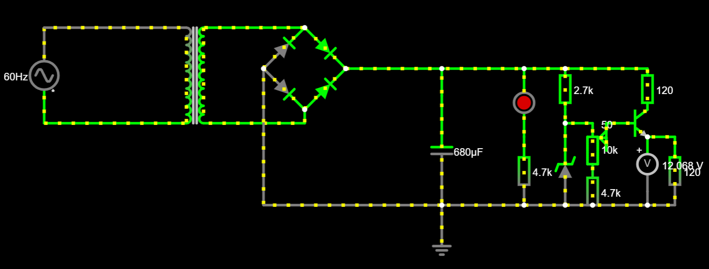
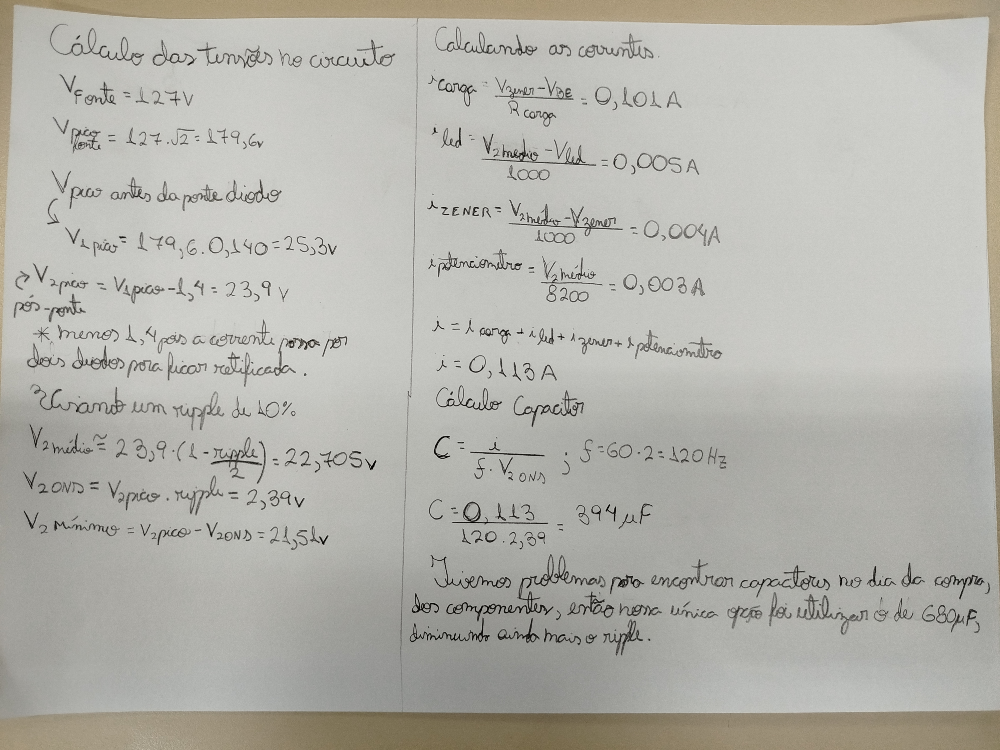

# Projeto-Eletronica-USP
## Projeto desenvolvido para a disciplina de Eletrônica
## Instruções:
Construção de uma fonte reficadora capaz de transformar corrente alternada de tensão eficaz de 127 volts (pico de 179,6 volts) em uma corrente contínua, com valor de tensão ajustável entre 3 e 12 volts.

Teremos a partir da tomada: tensão 127 volts, corrente alternada e frequência de 60 hz.
## Escolha dos componentes:
| Quantidade | Componentes       | Valor R$ |
|------------|-------------------|----------|
| 1          | Capacitor 680uF   | [R$ 5.80](https://produto.mercadolivre.com.br/MLB-1329526998-capacitor-eletrolitico-680uf-x-25v-105-10-pecas-_JM#position=1&search_layout=grid&type=item&tracking_id=e3802299-ff00-42ad-964e-d3a5aee62ea2)|
| 1          | Resistor 2K7 ohm  | [R$ 0.70](https://produto.mercadolivre.com.br/MLB-2715520561-100-unidades-resistor-27k-5-14w-cr25-2k7-_JM?matt_tool=14213447&matt_word=&matt_source=bing&matt_campaign=MLB_ML_BING_AO_CE-ALL-ALL_X_PLA_ALLB_TXS_ALL&matt_campaign_id=382858295&matt_ad_group=CE&matt_match_type=e&matt_network=o&matt_device=c&matt_keyword=default&msclkid=e1b9d86fc71116606eb9be032e0e646a&utm_source=bing&utm_medium=cpc&utm_campaign=MLB_ML_BING_AO_CE-ALL-ALL_X_PLA_ALLB_TXS_ALL&utm_term=4581596253419741&utm_content=CE)|
| 1          | Resistor 4K7 ohm  | [R$ 0.70](https://produto.mercadolivre.com.br/MLB-3389009219-resistor-4k7-cr25-14w-5-alta-qualidade-pacote-500-pecas-_JM#is_advertising=true&position=2&search_layout=grid&type=pad&tracking_id=d5ff520b-1146-494a-bd8a-95c6fa6acacd&is_advertising=true&ad_domain=VQCATCORE_LST&ad_position=2&ad_click_id=NDYyYmZkZDAtOWU3OC00YmM3LTgzOTAtODRhNDUyMTVjMmVm)|
| 1          | Diodo Zener (13v) | [R$ 0.70](https://produto.mercadolivre.com.br/MLB-1437492980-kit-50-pecas-diodo-zener-13v-1w-1n4743a-a-granel--_JM?matt_tool=14213447&matt_word=&matt_source=bing&matt_campaign=MLB_ML_BING_AO_CE-ALL-ALL_X_PLA_ALLB_TXS_ALL&matt_campaign_id=382858295&matt_ad_group=CE&matt_match_type=e&matt_network=o&matt_device=c&matt_keyword=default&msclkid=cd780d21d7aa10914c036b4d3e2afb26&utm_source=bing&utm_medium=cpc&utm_campaign=MLB_ML_BING_AO_CE-ALL-ALL_X_PLA_ALLB_TXS_ALL&utm_term=4581596253419739&utm_content=CE)|
| 1          | Potenciômetro 10K | [R$ 7.00](https://produto.mercadolivre.com.br/MLB-1178895152-kit-10-potenciometro-linear-10k-16mm-linear-_JM?matt_tool=14213447&matt_word=&matt_source=bing&matt_campaign=MLB_ML_BING_AO_CE-ALL-ALL_X_PLA_ALLB_TXS_ALL&matt_campaign_id=382858295&matt_ad_group=CE&matt_match_type=e&matt_network=o&matt_device=c&matt_keyword=default&msclkid=519cbb9024fb13dddea5ddfccd4e713c&utm_source=bing&utm_medium=cpc&utm_campaign=MLB_ML_BING_AO_CE-ALL-ALL_X_PLA_ALLB_TXS_ALL&utm_term=4581596253419738&utm_content=CE)|
| 1          | Ponte Retificadora| [R$ 3.90](https://produto.mercadolivre.com.br/MLB-1290426853-kit-10-ponte-retificadora-2a-1000v-original-_JM?matt_tool=14213447&matt_word=&matt_source=bing&matt_campaign=MLB_ML_BING_AO_CE-ALL-ALL_X_PLA_ALLB_TXS_ALL&matt_campaign_id=382858295&matt_ad_group=CE&matt_match_type=e&matt_network=o&matt_device=c&matt_keyword=default&msclkid=650bb0b5b40c1b56d52ed6d95e0eaf1b&utm_source=bing&utm_medium=cpc&utm_campaign=MLB_ML_BING_AO_CE-ALL-ALL_X_PLA_ALLB_TXS_ALL&utm_term=4581596253419738&utm_content=CE)|
| 1          | Led Vermelho 5mm  | [R$ 1.00](https://www.mercadolivre.com.br/led-vermelho-difuso-5mm-50-unidades-eletrnica-arduino-3v/p/MLB26787530#searchVariation=MLB26787530&position=2&search_layout=grid&type=product&tracking_id=adfecce4-4978-48c7-b7f0-c813b5bcd303)|
| 2          |Resistor 120 ohm 5W| [R$ 1.00](https://produto.mercadolivre.com.br/MLB-3518008789-47-r-ohms-10-pecas-resistor-de-carbono-5w-47r-ohms-5-_JM?matt_tool=14213447&matt_word=&matt_source=bing&matt_campaign=MLB_ML_BING_AO_CE-ALL-ALL_X_PLA_ALLB_TXS_ALL&matt_campaign_id=382858295&matt_ad_group=CE&matt_match_type=e&matt_network=o&matt_device=c&matt_keyword=default&msclkid=3c4b916e04d01b7cbaecf702ee0ca213&utm_source=bing&utm_medium=cpc&utm_campaign=MLB_ML_BING_AO_CE-ALL-ALL_X_PLA_ALLB_TXS_ALL&utm_term=4581596253419740&utm_content=CE)|
| 1          | Transistor NPN    | [R$ 2.00](https://produto.mercadolivre.com.br/MLB-1608263867-transistor-npn-tip41c-6-pecas-tip-41c-tip41-tip-41-ip41-_JM?matt_tool=14213447&matt_word=&matt_source=bing&matt_campaign=MLB_ML_BING_AO_CE-ALL-ALL_X_PLA_ALLB_TXS_ALL&matt_campaign_id=382858295&matt_ad_group=CE&matt_match_type=e&matt_network=o&matt_device=c&matt_keyword=default&msclkid=d61d18ae39b0139c4cf27ec2d34b9d83&utm_source=bing&utm_medium=cpc&utm_campaign=MLB_ML_BING_AO_CE-ALL-ALL_X_PLA_ALLB_TXS_ALL&utm_term=4581596253419738&utm_content=CE)|
| 1          | Protoboard        | [R$ 21.70](https://produto.mercadolivre.com.br/MLB-1421607788-protoboard-400-pontos-_JM?matt_tool=14213447&matt_word=&matt_source=bing&matt_campaign=MLB_ML_BING_AO_CE-ALL-ALL_X_PLA_ALLB_TXS_ALL&matt_campaign_id=382858295&matt_ad_group=CE&matt_match_type=e&matt_network=o&matt_device=c&matt_keyword=default&msclkid=95af03b37607195f2a4e65df9d116282&utm_source=bing&utm_medium=cpc&utm_campaign=MLB_ML_BING_AO_CE-ALL-ALL_X_PLA_ALLB_TXS_ALL&utm_term=4581596253419740&utm_content=CE)|
| 10         | Fios Jumper       | [R$ 7.00](https://www.mercadolivre.com.br/40-x-jumper-fio-conector-macho-macho-protoboard-20-cm/p/MLB36837941?pdp_filters=item_id:MLB4690760302#is_advertising=true&searchVariation=MLB36837941&position=1&search_layout=grid&type=pad&tracking_id=b294b6b8-0712-4527-878b-30fb19ecc216&is_advertising=true&ad_domain=VQCATCORE_LST&ad_position=1&ad_click_id=ODgwN2Y5ZWQtODU0Yi00MzY1LWIzZTktNmFhMDcwZjhiYzFj)|
| **Total**  |                   | **R$ 51,50**    |
## Componentes
1. **Transformador**: primeiro componente do circuito após a fonte de corrente alternada (tomada). Será responsável por reduzir de 127v a ddp proveninete da tomada para o valor desejado pela projeto (3-12v). O transformador escolhido é capaz de abaixar a tensão de 110 volts para 12 volts.

2. **Ponte de diodo(Ponte retificadora)**: utilizada para que o circuito seja abastecido com a corrente em ambos ciclos da corrente alternada.

3. **Capacitor**:  armazena a carga durante os ciclos da corrente alternada, liberando corrente quando a tensão interna é maior que a tensão vinda da fonte. Descarrega quando ocorre a inversão de ciclo.

4. **Diodo Zener**: regulador de tensão máxima. Somente conduz corrente quando a tensão que chegar alcança a tensão nominal do diodo, que no caso deste projeto, será 12v. Se a tensão for menor do que 12v, o Diodo não conduz e, portanto, não interfere no circuito, se for maior, deixará a corrente passar, mantendo a tensão em 12v naquele ponto. Informalmente, o diodo Zener “trava” o valor da tensão em 12v, que é exatamente o valor de tensão máximo que queremos na saída da nossa fonte.

5. **Resistores**: complementam o circuito de forma a limitar a corrente e impedindo que a corrente do circuito ultrapasse os valores limites dos componentes.

6. **Potenciometro**: resistor variável que permitirá o controle do valor da tensão resultante entre 3 e 12 volts.

7. **Transistor**: utilizado para permitir a passagem da corrente de forma ajustável.
## Imagem do Circuito

## Cálculo do Capacitor

## Link do circuito no Falstad:
[Link_para_o_circuito](https://tinyurl.com/259cu76j)

## Vídeo no Youtube da fonte
[Download Video](https://youtu.be/6sgpQ-ToUSU)

## Alunos:
Juan Henriques Passos([Juan](https://github.com/JuanHPassos))

Kattryel

Marcos Cota
